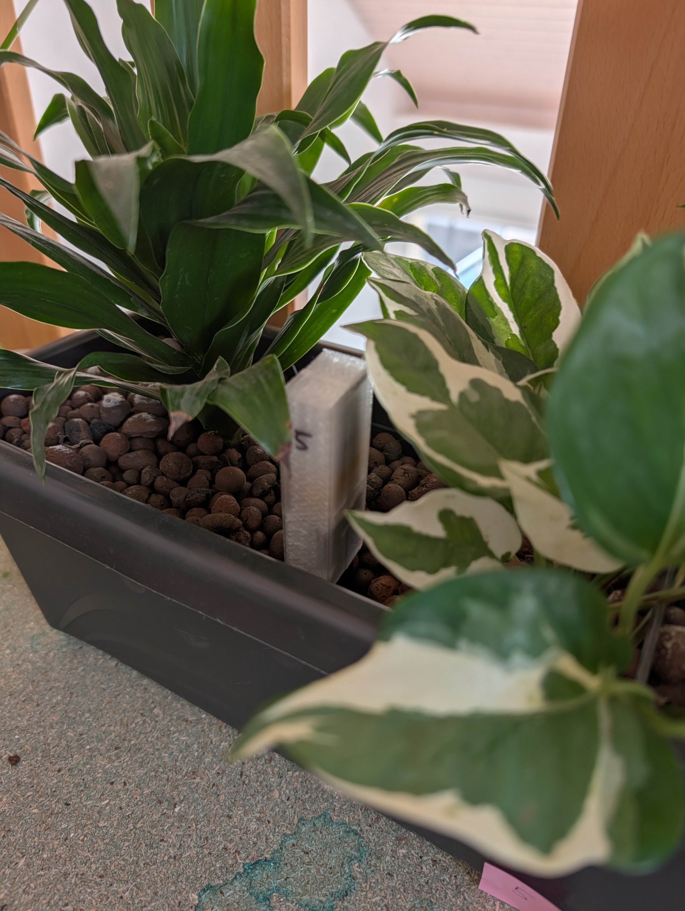
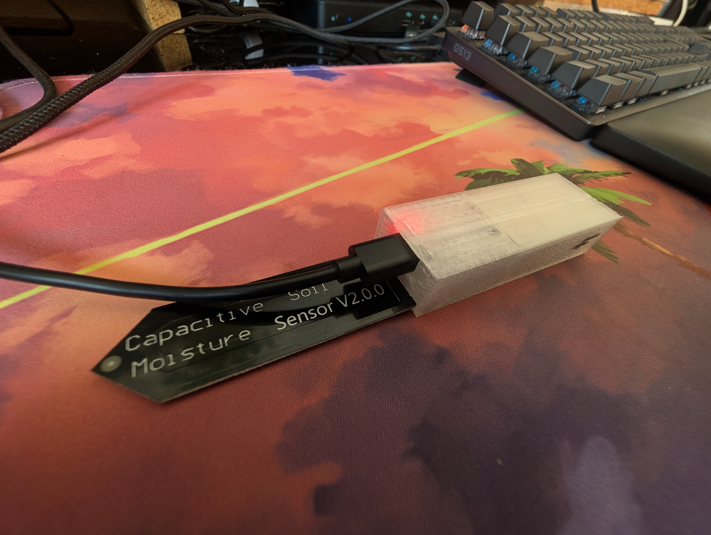
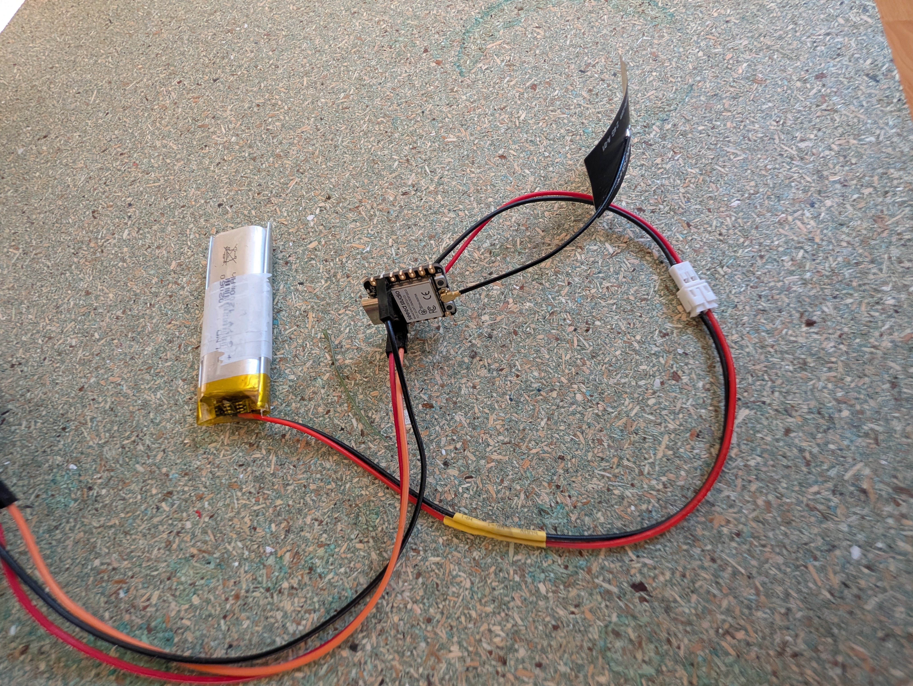
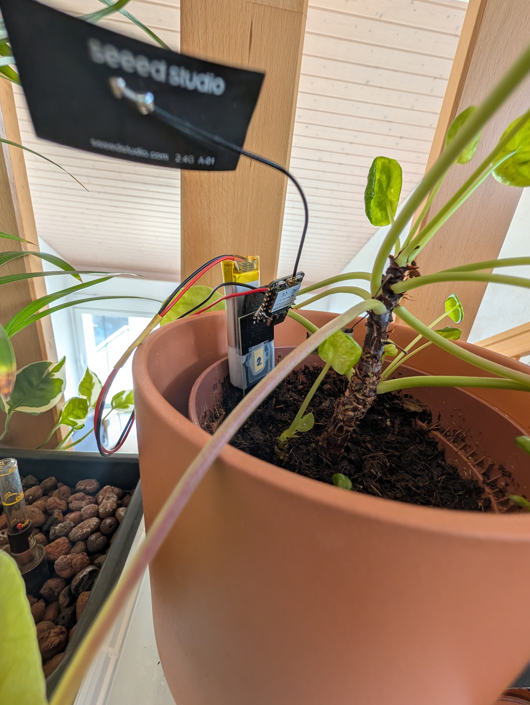
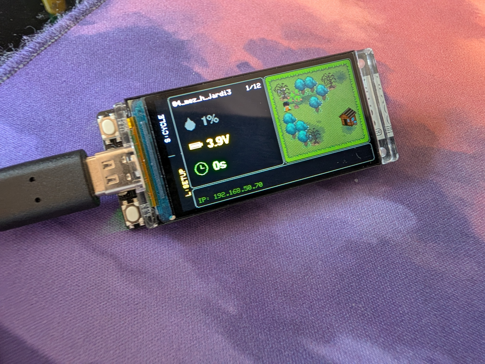
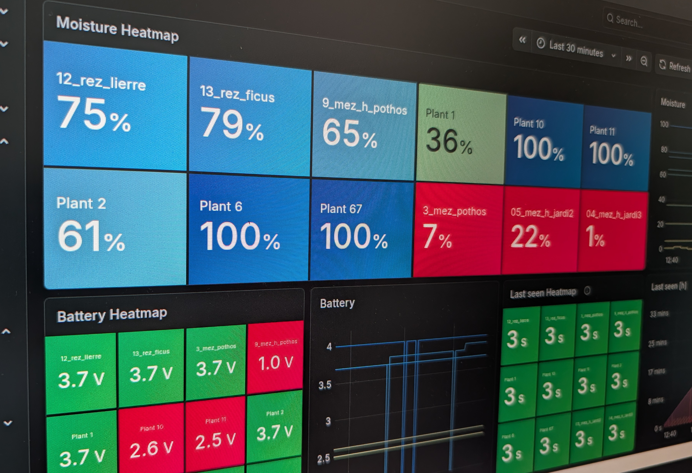

= Interior Plants Watering System

A comprehensive plant monitoring and automated watering system based on the ESP32 platform. This project consists of low-power Bluetooth Low Energy (BLE) moisture sensors distributed across your plants, and a central base station that aggregates data, provides a monitoring interface, and controls water pumps to keep your plants happy.

== Status

As of Summer 2026, active development is primarily focused on finalizing the sensor nodes. The immediate goals are to ensure their reliability and to design a 3D-printable enclosure for them. The central server does not yet control the water pumps; it currently features a minimal UI and exposes a Prometheus endpoint. For the time being, sensor data is observed and troubleshooted primarily via Grafana dashboards.

[cols="1,1,1", frame="none", grid="none"]
|===
| 
| 
| 

| 
| 
| 
|===

== System Architecture

The system is split into two main components, which will be integrated into this repository:

=== 1. Plant Sensor (The "Nodes")
A low-power BLE soil moisture sensor node. Designed for battery-powered deployment, it spends most of its life in deep sleep, waking periodically to sample soil moisture and broadcast telemetry.

See the link:sensor/README.adoc[Sensor Documentation] for detailed hardware configuration, pinouts, and calibration instructions.

* *Hardware:* Seeed Studio XIAO ESP32-C3, Capacitive Soil Moisture Sensor v1.2, 3.7V LiPo battery.
* *Features:* 
** Broadcasts telemetry via BLE manufacturer advertisements (no active connection required).
** Auto-calibration of dry/wet bounds stored in NVS flash.
** Battery voltage monitoring and smart power management (differentiates between USB and battery).

=== 2. Plant Server (The "Base Station")
The central controller that scans for BLE advertisements from the sensors, displays their status, and triggers water pumps when plants get too dry.

* *Hardware:* LilyGo T-Display ESP32 (or ESP32-S3), 4-channel relay board, and water pumps.
* *Features:*
** *Monitoring UI:* A clean data-focused display to monitor the real-world sensors.
** *Automated Watering:* Controls relays based on moisture readings with safety cooldowns and scheduling logic.
** *Metrics:* Serves Prometheus metrics for monitoring via Grafana.
** *Persistence:* Thread-safe sensor data management with NVS persistence for configuration and last-watered times.

== How It Works

1. *Sensors* read capacitive moisture levels and broadcast the raw data, calibration bounds, and battery voltage over BLE using a specific Service UUID (`a1b2c3d4-0001-4c9a-8f2e-5a7b9e3d6f80`).
2. The *Server* continuously scans the BLE spectrum for these specific advertisements.
3. The *Server* parses the data, updates its internal thread-safe store, and updates the display.
4. If a sensor's moisture drops below a threshold, the *Server's* Gardener module activates the corresponding relay to run a water pump.

== Getting Started

Each component has its own specific build instructions, configuration, and hardware setup. Please refer to the respective subdirectories (once imported) for detailed setup and deployment instructions.

* *For deploying a new sensor node:* You will need a XIAO ESP32-C3 and the Arduino IDE / `arduino-cli` to compile and upload the firmware. See the link:sensor/README.adoc[Sensor Setup Guide].
* *For setting up the base station:* You will need a LilyGo T-Display, WiFi credentials (for metrics), and the appropriate Arduino libraries (like `TFT_eSPI` configured for your display).

== License

This project is licensed under the GNU General Public License v3.0 (GPL-3.0). See the LICENSE file for details.
